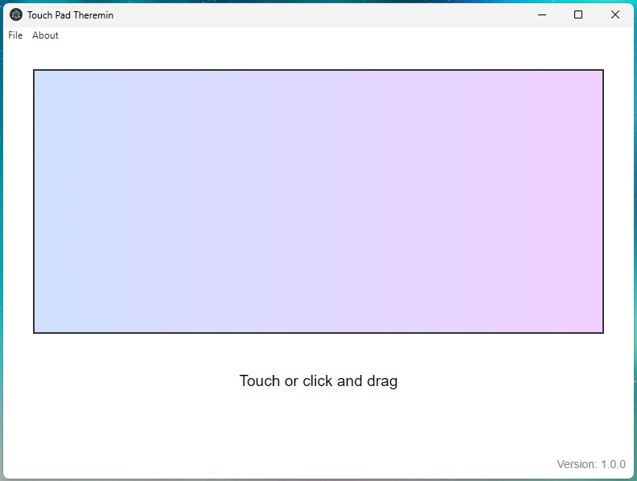

# TouchPad Theremin

A simple Electron app that generates a sine wave sound and lets you control its frequency and volume. The sound is played when you click or touch the screen, and the frequency adjusts from left to right while the volume adjusts based on vertical position.

## Features
- Generate sine wave sound using the Web Audio API.
- Control frequency with horizontal position (left to right).
- Control volume with vertical position (up to increase, down to decrease).
- Cross-platform support (macOS, Windows, Linux).
